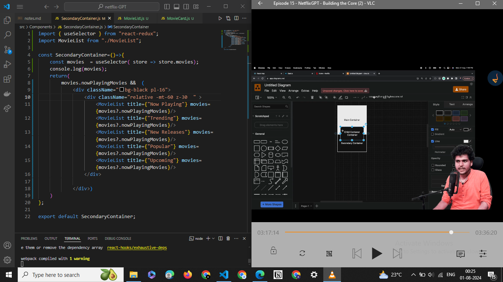

## create from scratch
- in terminal write = cd Desktop
- npx create-react-app netflix-gpt       (proj name)
- adding tailwind for create react app
- coomponetsn ,utils
###### routing
- install npm i -D react-router-dom
- import { createBrowserRouter, RouterProvider } from "react-router-dom";
- 

- header ,(getlogo ,gradient)
- loginf page froma sign in ,sign up (change onclick,useState)
- form validation (regex for email,password)
- useRef hook for getting input
### cc
- deploy app to production using firebase
- authentication using firebase
- create signup user account
- Implement sign in user api
- created Reduc store wtih userSlice 
- Implemented sign out -
- updated profile api call  

#### 2vid
- Bug fix ( without login user was accessing browse >> soln >.move useEffect from body to header as header presentt all over website so useEffect will be all over website)
- bug fix (keep allrouting logic only inside onauthstattechange >> and keep onauthstatechange inside header >>so whenever header reload onauthstatechange run it checks user login or logout and it will redirect to other pages using routes)
- unsubscribe to onauthstatechanged callback
- added hardcoded links to constant file

- register at tmdb site ,get apikey and,token
- made api call from tmdb documentation in browse page using fetch ,async, await, json ,useEffect
- use custom hook  useNowPlayingMovw to minnimalise browse page
###### after 1 hr
- to build browse page ,first part is trailer playing along with title so built it
- store has 20 movies data for trailer get first movie title
- that first movie will have multiple trailers,teaser get all by fetch api>> filter out trailers from them >> if muliple trailers choose the first trailer >> put that trailer key to yt >>share >>embed in return 
- make it dynamic 
- way 1 >> state var >> declare above , use below trailer key
- way 2>> redux store >>put trailer to redcux store using dispatch then u can access that trailer info from anywhere >> so to get key of that trailer ufrom stor using useSelector
- way 2 good 
- overall for trailervideo component ,we get trailer from tmdb api ,we fileter find trailer, put trailer to store, accesse the trailer from store using selecote , used the trailer key

##### after 2 hr
- use custom hook for above purpose useMovieTrailer(movieId);
reemm passprop w/o {}  becauease it is hook , for componenrt to pass props use {}
- main container >> first container ,secondary container
- get trailer from yt share,embed ,autoplay ,mute
- add title as gradient ,buttons
- build secondary container
- movielist, moviecards fetch from store for each category using custom hook
- make moviecards dynamic card for whole list shocwn using its id, poster_path from api
- make child container relative using -margintop ,above first container 
- 
- basically pass props from secondary containeer ,accept in movielist , use them in movielist , get poster path and pass it as a prop to moviecard 
- use custom hooks for to put api data to our store for popular,top rated , upcoming movies 
- and use this store data in secondary container, for movielist
- usePopularMovies, usetopratedmovies,useupcomingmovies hooks
- Gan Gan Ganaat Bote
 - fetch movies from tmdb(api stable)
 - buling search gpt 
 - builded search comp , build togglesearchview sllice when user click on search then diff page open 
 ##### multi language
 - multi languages searchbar(langguageconstant)
 - multi language pages
 -  make configslice default lang en ,add to appstore
 -  add onchange handlievent e dispatch e.target.value ( have store the selected language add it tp store)
 - access in search bar which lang in store currently an show data in that langg using useselecotor ,, lang[langKey].search/placeholder
 - show langopt only when in searh page again in headeeer read from store if showsearch true or false then showlang && langopt

- remove react.stricmode form  main file so that everyting just run ones due to strict mode everutiing run twice  but it will not consider in production build ,,it is good