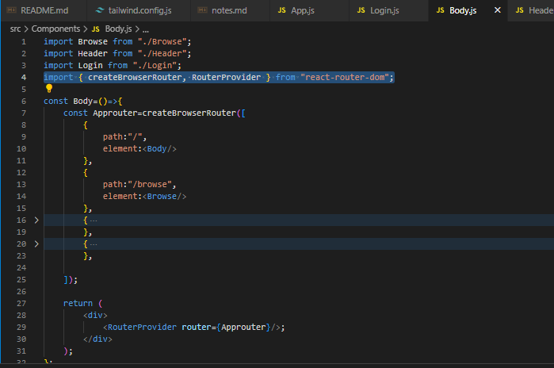

## create from scratch
- in terminal write = cd Desktop
- npx create-react-app netflix-gpt       (proj name)
- adding tailwind for create react app
- coomponetsn ,utils
###### routing
- install npm i -D react-router-dom
- import { createBrowserRouter, RouterProvider } from "react-router-dom";
- 